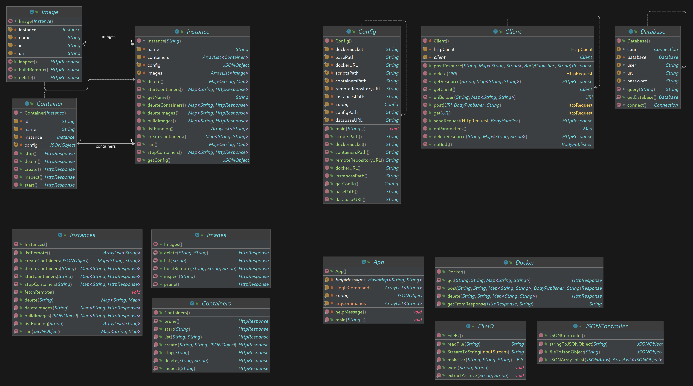

# Platea - Docker orchestrator

## Setup
### Dependencies
- socat
- docker

### Run the Postgresql database
```
docker run \
    --name pgdb \
    --env-file .env \
    -P -p 5432:5432 \
    -v $PWD/.dbdata:/var/lib/postgresql/data \
    -v $PWD/schema.sql:/docker-entrypoint-initdb.d/schema.sql \
    -d postgres
```
### Example dotenv
```
POSTGRES_PASSWORD=platea
POSTGRES_USER=platea
POSTGRES_DB=platea
POSTGRES_URL=jdbc:postgresql:platea
```

## Usage

### fetch-instances
	platea --fetch-instances
	fetching from the remote repository [url]...
### list-instances
	platea --list-instances
		- lcarnevale
		- config2
		- config3
### build
	platea build INSTANCE
### start
	platea start INSTANCE
### run
	platea run INSTANCE
### stop
	platea stop INSTANCE

# UML Scheme

