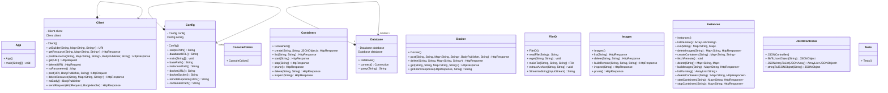

```mermaid
classDiagram
direction BT
class App {
  + App() 
  + main(String[]) void
}
class Client {
  - Client() 
  - Client client
  + uriBuilder(String, Map~String, String~) URI
  + getResource(String, Map~String, String~) HttpResponse
  + postResource(String, Map~String, String~, BodyPublisher, String) HttpResponse
  + get(URI) HttpRequest
  + delete(URI) HttpRequest
  + noParameters() Map
  + post(URI, BodyPublisher, String) HttpRequest
  + deleteResource(String, Map~String, String~) HttpResponse
  + noBody() BodyPublisher
  + sendRequest(HttpRequest, BodyHandler) HttpResponse
   Client client
}
class Config {
  - Config() 
  - Config config
  + scriptsPath() String
  + databaseURL() String
  + main(String[]) void
  + basePath() String
  + instancesPath() String
  + dockerURL() String
  + dockerSocket() String
  + remoteRepositoryURL() String
  + containersPath() String
   Config config
}
class ConsoleColors {
  + ConsoleColors() 
}
class Containers {
  + Containers() 
  + create(String, String, JSONObject) HttpResponse
  + list(String, String) HttpResponse
  + start(String) HttpResponse
  + stop(String) HttpResponse
  + prune() HttpResponse
  + delete(String, String) HttpResponse
  + inspect(String) HttpResponse
}
class Database {
  + Database() 
  - Database database
  ~ connect() Connection
  ~ query(String) String
   Database database
}
class Docker {
  + Docker() 
  + post(String, String, Map~String, String~, BodyPublisher, String) HttpResponse
  + delete(String, String, Map~String, String~) HttpResponse
  + get(String, String, Map~String, String~) HttpResponse
  + getFromResponse(HttpResponse, String) String
}
class FileIO {
  + FileIO() 
  + readFile(String) String
  + wget(String, String) void
  + makeTar(String, String, String) File
  + extractArchive(String, String) void
  + StreamtoString(InputStream) String
}
class Images {
  + Images() 
  + list(String) HttpResponse
  + delete(String, String) HttpResponse
  + buildRemote(String, String, String) HttpResponse
  + inspect(String) HttpResponse
  + prune() HttpResponse
}
class Instances {
  + Instances() 
  + listRemote() ArrayList~String~
  + run(String) Map~String, Map~
  + deleteImages(String) Map~String, HttpResponse~
  + createContainers(String) Map~String, String~
  + fetchRemote() void
  + delete(String) Map~String, Map~
  + buildImages(String) Map~String, HttpResponse~
  + listRunning() ArrayList~String~
  + deleteContainers(String) Map~String, HttpResponse~
  + startContainers(String) Map~String, HttpResponse~
  + stopContainers(String) Map~String, HttpResponse~
}
class JSONController {
  + JSONController() 
  + fileToJsonObject(String) JSONObject
  + JSONArrayToList(JSONArray) ArrayList~JSONObject~
  + stringToJSONObject(String) JSONObject
}
class Tests {
  + Tests() 
}

Client "1" *--> "client 1" Client 
Config "1" *--> "config 1" Config 
Database "1" *--> "database 1" Database 
```
