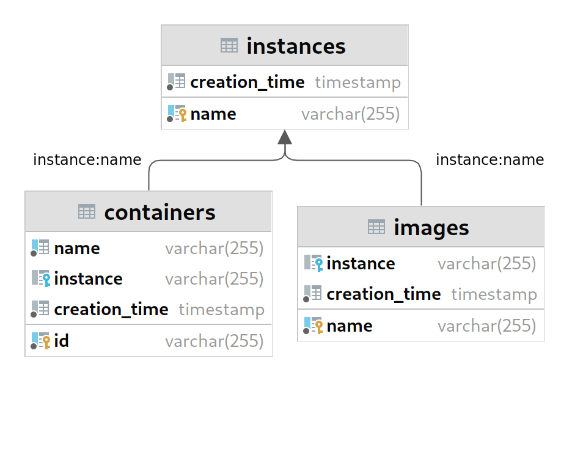
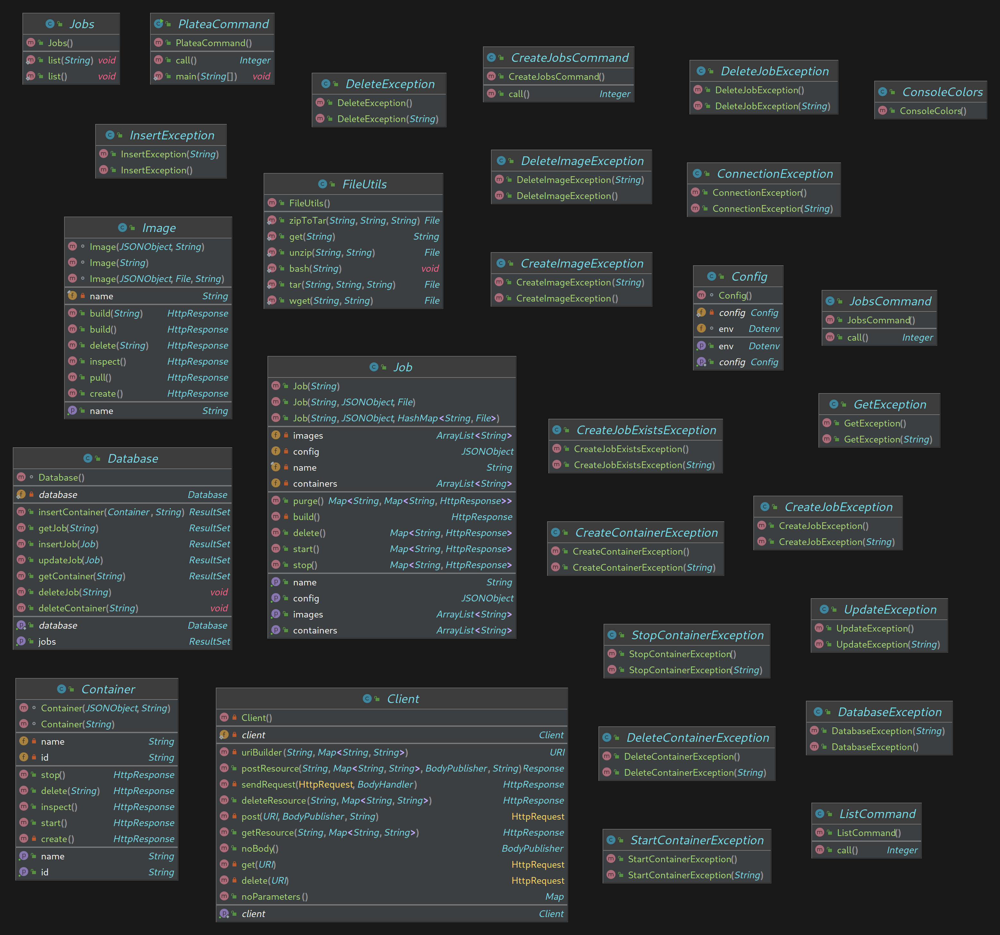

# Platea - Docker container orchestrator
*Gabriele Aloisio, 22 novembre 2022*

## Indice
- [Platea - Docker container orchestrator](#platea---docker-container-orchestrator)
  - [Indice](#indice)
  - [Introduzione](#introduzione)
  - [Operazioni](#operazioni)
  - [Architettura](#architettura)
    - [Dipendenze](#dipendenze)
    - [Diagramma ER database](#diagramma-er-database)
    - [Diagramma UML](#diagramma-uml)
  - [Classi](#classi)
    - [platea.Client](#plateaclient)
    - [platea.Config](#plateaconfig)
    - [platea.ConsoleColors](#plateaconsolecolors)
    - [platea.Container](#plateacontainer)
    - [platea.Database](#plateadatabase)
    - [platea.FileUtils](#plateafileutils)
    - [platea.Image](#plateaimage)
    - [platea.Job](#plateajob)
    - [platea.Jobs](#plateajobs)
    - [commands.CreateJobsCommand](#commandscreatejobscommand)
    - [commands.JobsCommand](#commandsjobscommand)
    - [commands.ListCommand](#commandslistcommand)
    - [commands.PlateaCommand](#commandsplateacommand)
    - [Exceptions](#exceptions)
      - [Docker](#docker)
      - [Database](#database)
  - [Requisiti](#requisiti)
    - [Information Hiding](#information-hiding)
    - [Incapsulamento](#incapsulamento)
    - [Overloading](#overloading)
    - [Networking](#networking)


## Introduzione
L'applicativo consiste nel provisioning automatico di container grazie a dei file di configurazione, facendo da intermediario tra l'utente e il Docker Engine installato sulla macchina, con l'aggiunta degli automatismi che permettono la gestione dei container in modalità *cluster*. Le dipendenze vengono gestite con Maven, mentre il database PostgreSQL tiene traccia di ciò che viene creato ed eseguito. Il programma scarica i config JSON da una repositoria (su GitHub o altro) e viene eseguito il parsing degli oggetti JSON, aventi un formato del tipo

```
{
    "name": str,
    "images": [
      {
        "name": str,
        "source": bool,
        "script": str,
        "endpoint": str
      },...
    ],
  
    "containers": [
      {
        <Docker Engine payload>
      }, ...
    ]
  }
  
```

Una volta parsato il JSON, viene scaricata sorgente dell'immagine dalla repositoria e viene eseguito un build dell'immagine, con una seguente creazione di un container dallo stesso nome e l'assegnazione dei due ad un ***job*** (cluster di container).

## Operazioni

L'utente deve essere in grado di:
- Scrivere una configurazione per un ***job***
- Eseguire il build delle immagini
- Avviare un *job* con una **configurazione locale**
- Avviare un *job* con una **configurazione remota**
- Fermare un *job*
- Rimuovere un *job*
- Visualizzare i *job* che sono attualmente in esecuzione
- Visualizzare le **configurazioni** dei *job* presenti sulla repositoria

## Architettura
Come prima viene avviato un server middleware tcp con `socat`, in modo tale da contattare il socket Unix del Docker Engine. Specificato il file di configurazione remoto o locale, viene aperto uno stream per caricarlo in memoria. Creatosi un *job*, e contattata l'API del Docker Engine avviene il seguente processo:

1. Inserzione del ***job*** sul database nella tabella ***jobs***
2. Esecuzione del build di una o più **immagini** da parte del Docker Engine
3. Creazione di uno o più **container** da parte del Docker Engine
4. Inserzione sul database dei container nella tabella *containers*
5. Eventuale avvio dei container da parte del Docker Engine

Per ogni inserzione del database viene prima eseguito un controllo per verificare l'esistenza di quel record. Nel caso esistesse già, viene prelevato l'id ed assegnato all'oggetto Java. 

### Dipendenze
- org.apache.httpcomponents
- org.postgresql
- org.json
- info.picocli
- org.rauschig
- io.github.cdimascio


### Diagramma ER database


### Diagramma UML


## Classi

### platea.Client
`public class Client()`

Classe statica singleton per la gestione della connessione al Docker Engine

**Attributi**
- `private final HttpClient httpClient`
- `private static Client client`

**Metodi**
- `private Client()`
- `public static synchronized Client getClient()`
- `private URI uriBuilder(String path, Map<String, String> params)`
- `private HttpResponse sendRequest(HttpRequest method, BodyHandler bHandler)`
- `private HttpRequest get(URI uri)`
- `private HttpRequest post(URI uri, BodyPublisher body, String headers)`
- `private HttpRequest delete(URI uri)`
- `public HttpResponse getResource(String path, Map<String, String> params)`
- `public HttpResponse postResource(String path, Map<String, String> params, BodyPublisher body, String headers)`
- `public HttpResponse deleteResource(String path, Map<String, String> params)`
- `public BodyPublisher noBody()`
- `public Map noParameters()`

### platea.Config
`public class Config()`

Classe statica singleton per la gestione delle configurazioni di Platea con un dotenv

**Attributi**
- `private static Config config`
- `Dotenv env`

**Metodi**
- `Config()`
- `public static synchronized Config getConfig()`
- `public Dotenv getEnv()`

### platea.ConsoleColors
`public class ConsoleColors()`

Definizione di costanti per l'utilizzo dei colori di stampa a schermo del tipo:
`public static final String COLOR = "<color code>"`

### platea.Container
`public class Container()`

Classe che rappresenta un Docker container
**Attributi**
- `private JSONObject config`
- `private final JSONObject labels`
- `private String name`
- `private String id`

**Metodi**
- `Container(JSONObject config, String jobName) throws CreateContainerException`
- `Container(String id)`
- `private HttpResponse create() throws CreateContainerException`
- `public HttpResponse start() throws StartContainerException`
- `public HttpResponse stop() throws StopContainerException`
- `public HttpResponse delete(String force) throws DeleteContainerException`
- `public HttpResponse inspect()`
- `public String getId()`
- `public String getName()`

### platea.Database
`public static synchronized Database getDatabase()`

Classe statica singleton per la gestione della connessione al database PostgreSQL utilizzando JDBC

**Attributi**
- `private static Database database`
- `private final Connection connection`

**Metodi**
- `Database() throws ConnectionException`
- `public static synchronized Database getDatabase()`
- `public ResultSet updateJob(Job job) throws UpdateException`
- `public ResultSet insertJob(Job job) throws InsertException`
- `public ResultSet insertContainer(Container container, String jobName) throws InsertException`
- `public ResultSet getJobs() throws GetException`
- `public ResultSet getJob(String name) throws GetException`
- `public ResultSet getContainer(String id) throws GetException`
- `public void deleteJob(String name) throws DeleteException`
- `public void deleteContainer(String id) throws DeleteException`

### platea.FileUtils
`public class FileUtils()`

Classe statica per la gestione dei file
**Metodi**
- `public static File wget(String url, String path)`
- `public static String get(String url)`
- `public static File tar(String src, String dest, String name)`
- `public static File unzip(String archive, String dest)`
- `public static File zipToTar(String archive, String dest, String name)`
- `public static void bash(String cmd)`

### platea.Image
`public class Image()`

Classe che rappresenta una Docker image
**Attributi**
- `private final String name`
- `private String endpoint`
- `private boolean source`
- `private JSONObject labels`
- `private File script`

**Metodi**
- `Image(String name)`
- `Image(JSONObject config, String jobName) throws CreateImageException`
- `Image(JSONObject config, File script, String jobName) throws CreateImageException`
- `public HttpResponse create() throws CreateImageException`
- `public HttpResponse build()`
- `public HttpResponse build(String endpoint)`
- `public HttpResponse pull()`
- `public HttpResponse delete(String force) throws DeleteImageException`
- `public HttpResponse inspect()`
- `public String getName()`

### platea.Job
`public class Job()`

Classe per la gestione di container e immagini Docker in modalità cluster

**Attributi**
- `private JSONObject config`
- `private final String name`
- `private ArrayList<String> containers`
- `private ArrayList<String> images`
- `private File context`
- `private HashMap<String, File> scripts`

**Metodi**
- `public Job(String name, JSONObject config, File context) throws CreateJobException`
- `public Job(String name, JSONObject config, HashMap<String, File> scripts) throws CreateJobException`
- `public Job(String name) throws CreateJobException`
- `private HttpResponse build() throws CreateJobException`
- `public Map<String, HttpResponse> delete() throws DeleteJobException`
- `public Map<String, Map<String, HttpResponse>> purge() throws DeleteJobException`
- `public Map<String, HttpResponse> start() throws StartContainerException, StopContainerException`
- `public Map<String, HttpResponse> stop() throws StopContainerException`
- `public JSONObject getConfig()`
- `public String getName()`
- `public ArrayList<String> getContainers()`
- `public ArrayList<String> getImages()`

### platea.Jobs
`public class Jobs()`

Collezione di metodi statici inerenti a `Job`

**Metodi**
- `public static void list()`
- `public static void list(String jobName)`

### commands.CreateJobsCommand
`@CommandLine.Command() public class CreateJobsCommand implements Callable<Integer>`

**Attributi**
- `@CommandLine.Option() String jobName`
- `@CommandLine.Option() String configName`
- `@CommandLine.Option() boolean local`
- `@CommandLine.Option() File context`
  
**Metodi**
- `@Override public Integer call()`


### commands.JobsCommand
`@CommandLine.Command() public class JobsCommand implements Callable<Integer>`

**Attributi**
- `@CommandLine.Option() boolean delete`
- `@CommandLine.Option() boolean purge`
- `@CommandLine.Option() boolean start`
- `@CommandLine.Option() boolean stop`
- `@CommandLine.Option() jobName`

**Metodi**
- `@Override public Integer call()`

### commands.ListCommand
`@CommandLine.Command() public class ListCommand implements Callable<Integer>`

**Attributi**
- `@CommandLine.Option() String jobName`

**Metodi**
- `@Override public Integer call()`

### commands.PlateaCommand
`@CommandLine.Command() public class PlateaCommand implements Callable<Integer>`

**Attributi**
- `final Integer SUCCESS = 0`
- `final Integer FAILURE = 1`
- `@CommandLine.Option() boolean verbose`
- `@CommandLine.Option() boolean fetch`
- `@CommandLine.Option() boolean list`

**Metodi**
- `public static void main(final String[] args)`
- `public Integer call()`

### Exceptions
- CreateJobException 
- CreateJobExistsException

#### Docker
- CreateContainerException
- CreateImageException
- DeleteContainerException
- DeleteImageException
- DeleteJobException
- StartContainerException
- StopContainerException

#### Database
- ConnectionException
- DatabaseException
- DeleteException
- GetException
- InsertException
- UpdateException

## Requisiti

### Information Hiding
L'information hiding è un concetto che permette di nascondere il modo in cui un metodo o una classe sono
stati implementati. Permette quindi a una classe di usarne un’altra senza sapere come funziona, dando
ai programmatori la possibilità di cambiare l’implementazione di quest’ultima senza dover cambiare il
resto del codice. Un esempio di information hiding può essere l'implementazione della classe `Client`, dove metodi come `get()`, `post()` e `delete()` sono privati e utilizzati rispettivamente dai metodi pubblici `getResource()`, `postResource()`, `deleteResource()`:

```
private HttpRequest get(URI uri) {
    /* Generic GET method */
    return
            HttpRequest.newBuilder(uri)
                    .timeout(Duration.ofSeconds(10))
                    .GET()
                    .build();
    }

private HttpRequest post(URI uri, BodyPublisher body, String headers) {
    /* Generic POST method */
    return
            HttpRequest.newBuilder(uri)
                    .timeout(Duration.ofSeconds(10))
                    .POST(body)
                    .headers("Content-Type", headers)
                    .build();
    }

private HttpRequest delete(URI uri) {
    /* Generic DELETE method */
    return
            HttpRequest.newBuilder(uri)
                    .timeout(Duration.ofSeconds(10))
                    .DELETE()
                    .build();
    }

public HttpResponse getResource(String path, Map<String, String> params) {
        return
            sendRequest(
                    get(uriBuilder(path, params)),
                    BodyHandlers.ofString());
    }

    public HttpResponse postResource(String path, Map<String, String> params, BodyPublisher body, String headers) {
        return
            sendRequest(
                    post(uriBuilder(path, params), body, headers),
                    BodyHandlers.ofString());
    }

    public HttpResponse deleteResource(String path, Map<String, String> params) {
        return
            sendRequest(delete(uriBuilder(path, params)),
                    BodyHandlers.ofString());
    }


```

### Incapsulamento
L'incapsulamento è la proprietà per cui i dati che definiscono lo stato interno di un oggetto e i metodi che ne definiscono la logica sono accessibili ai metodi dell'oggetto stesso, mentre non sono visibili ai client. Per alterare lo stato interno dell'oggetto, è necessario invocarne i metodi pubblici, ed è questo lo scopo principale dell'incapsulamento. Infatti, se gestito opportunamente, esso permette di vedere l'oggetto come una black-box, cioè una "scatola nera" con la quale l'interazione avviene solo e solamente tramite i metodi definiti dall'interfaccia. Il punto è dare delle funzionalità agli utenti nascondendo i dettagli legati alla loro implementazione. Questo concetto è implementato ad esempio nella definizione della classe `Job`:

Gli attributi

```
private JSONObject config;
private final String name;
private ArrayList<String> containers = new ArrayList<>();
private ArrayList<String> images = new ArrayList<>();
```

Sono accessibili con i getters/setters

```
public JSONObject getConfig() {
        return this.config;
    }

public String getName() {
    return this.name;
    }

public ArrayList<String> getContainers() {
    return this.containers;
    }

public ArrayList<String> getImages() {
    return this.images;
    }
```


### Overloading
L'overloading è il concetto della definizione di un metodo con lo stesso nome ma con firme diverse. Questo è banalmente implementato nella classe `Image`:

    Image(String name) {
        this.name = name;
    }

    Image(JSONObject config, String jobName) throws CreateImageException {
        this.name = config.getString("name");
        this.endpoint = config.getString("endpoint");
        this.source = config.getBoolean("source");

        // Labels object setup
        this.labels = new JSONObject();
        this.labels.put("service", "platea");
        this.labels.put("job", jobName);

        create();
    }

    Image(JSONObject config, File script, String jobName) throws CreateImageException {
        /* Create an image given a configuration script */

        this.name = config.getString("name");
        this.endpoint = config.getString("endpoint");
        this.source = config.getBoolean("source");
        this.script = script;

        // Labels object setup
        this.labels = new JSONObject();
        this.labels.put("service", "platea");
        this.labels.put("job", jobName);

        create();
    }

### Networking
Java fornisce le classi DatagramSocket e DatagramPacket per le connessioni in modalità UDP, mentre Socket e ServerSocket vengono utilizzate per la modalità TCP. Nel caso di Platea, viene utilizzata la libreria **http** per facilitare la connessione con il server bridge TCP al Docker Engine.

La classe `Client` definisce un attributo di classe `HttpClient`, che fornisce il metodo `send()` e ritorna un oggetto `HttpResponse`. La classe statica `HttpRequest` fornisce `newBuilder()` che crea un nuovo oggetto `HttpRequest`:

```
private Client() {
    httpClient = HttpClient.newHttpClient();

    // Map Unix socket to tcp address
    String[] cmd = {"/bin/sh", "-c", "socat -v tcp-l:2375,reuseaddr unix:/var/run/docker.sock"};
    File log = new File(Config.getConfig().getEnv().get("BASE_PATH") + "/docker.log");

    try {
        log.createNewFile();

        new ProcessBuilder()
                //.inheritIO()
                .redirectOutput(log)
                .redirectError(log)
                .command(cmd)
                .start();

    } catch (IOException e) {
        System.out.println(e.getMessage());
        System.exit(2);
    }
}

private HttpResponse sendRequest(HttpRequest method, BodyHandler bHandler) {
    HttpResponse tmp = null;

    try {
        tmp = this.httpClient.send(method, bHandler);

    } catch (InterruptedException | IOException e) {
        System.out.println("Error while sending request to Docker Engine: " + e.getMessage());
        System.exit(2);
    }

    return tmp;
}

private HttpRequest get(URI uri) {
        /* Generic GET method */
        return
            HttpRequest.newBuilder(uri)
                .timeout(Duration.ofSeconds(10))
                .GET()
                .build();
}

private HttpRequest post(URI uri, BodyPublisher body, String headers) {
    /* Generic POST method */
    return
            HttpRequest.newBuilder(uri)
                    .timeout(Duration.ofSeconds(10))
                    .POST(body)
                    .headers("Content-Type", headers)
                    .build();
}

private HttpRequest delete(URI uri) {
    /* Generic DELETE method */
    return
            HttpRequest.newBuilder(uri)
                    .timeout(Duration.ofSeconds(10))
                    .DELETE()
                    .build();
}


```