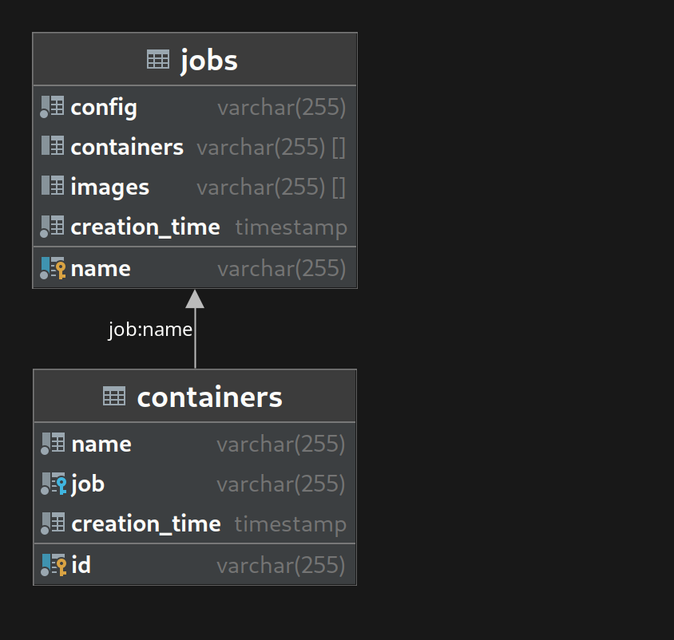

# Platea - Docker container orchestrator

## Introduzione
L'applicativo consiste nel provisioning automatico di container grazie a dei file di configurazione, facendo da intermediario tra l'utente e il Docker Engine installato sulla macchina, con l'aggiunta degli automatismi che permettono la gestione dei container in modalità *cluster*. Le dipendenze vengono gestite con Maven, mentre il database PostgreSQL tiene traccia di ciò che viene creato ed eseguito. Il programma scarica i config JSON da una repositoria (su GitHub o altro) e viene eseguito il parsing degli oggetti JSON, aventi un formato del tipo

```
{
    instanceName: string
    containers: {
        container1: {
            endpoint: string
            config: {
                <Docker container configuration file>
            }
        },

        container2: {
            ...
        },
        
        containerN: {
            ...
        }
    }
}
```

Una volta parsato il JSON, viene scaricata sorgente dell'immagine dalla repositoria e viene eseguito un build dell'immagine, con una seguente creazione di un container dallo stesso nome e l'assegnazione dei due ad una ***Istance*** (cluster di container).

## Operazioni

L'utente deve essere in grado di:
- Scrivere una configurazione per una instance 
- Eseguire il build delle immagini
- Avviare una instance
- Fermare una instance
- Rimuovere una instance
- Visualizzare le instance presenti sulla repositoria
- Aggiornare le instance presenti in locale con quelle presenti sulla repositoria
- Visualizzare le instance che sono attualmente in esecuzione

## Architettura

Vengono scaricati i file di configurazione dalla repositoria. Creatasi una instance, e contattata l'API del Docker Engine avviene il seguente processo:

1. Inserzione dell'*instance* sul database  nella tabella *instances*
2. Esecuzione del build di una o più immagini da parte del Docker Engine
3. Inserzione sul database delle immagini nella tabella *images*
4. Creazione di uno o più container da parte del Docker Engine
5. Inserzione sul database dei container nella tabella *containers*
6. Eventuale avvio dei container da parte del Docker Engine

Per ogni inserzione del database viene prima eseguito un controllo per verificare l'esistenza di quel record. Nel caso esistesse già, viene prelevato l'id ed assegnato all'oggetto Java. 

### Dipendenze
- com.fasterxml.jackson.core
- com.googlecode.json-simple
- org.postgresql
- org.apache.httpcomponents
- org.rauschig
- io.github.cdimascio


### Diagramma ER database


### Diagramma UML
